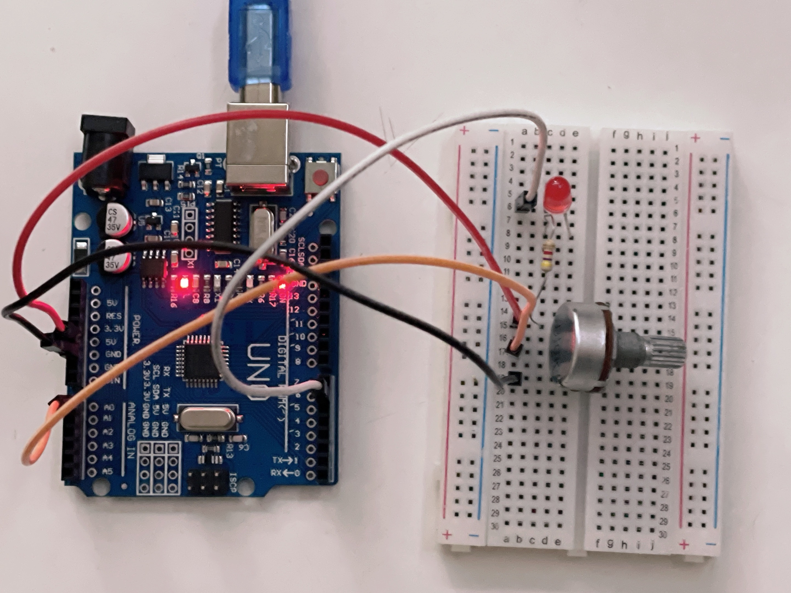

# Arduino LED Brightness Control with Potentiometer

This project demonstrates how to control the brightness of an LED using a potentiometer and an Arduino board.

## Hardware Components

- Arduino board
- Potentiometer
- Breadboard
- LED
- 1K Ohm resistor
- Jumper wires

## Circuit Diagram

## Demo

To see how the LED brightness control works, you can watch the demo [here](https://github.com/shathalshehri/Control-LED-Brightness-Using-Potientiometer/blob/main/ControlLEDBrightnessDemo.MOV).

## Code

The code to control the LED brightness using a potentiometer can be found in the [Control_LED_Brightness_with_aPotientiometer.ino](Control_LED_Brightness_with_aPotientiometer.ino) file.

